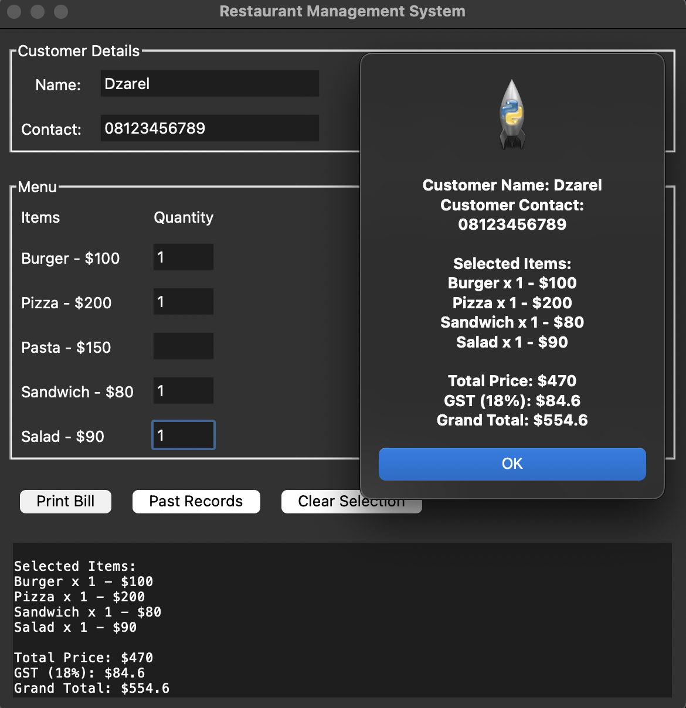

# Restoran Management System



This is a simple Restaurant Management System built using Python and Tkinter. It allows users to manage customer details, select menu items, calculate bills with GST, and view a sample bill.

## Features

*   **Customer Details:** Input customer name and contact information.
*   **Menu Selection:** Select various food items with their quantities.
*   **Bill Generation:** Generate a detailed bill including item-wise cost, total price, GST, and grand total.
*   **Sample Bill Display:** View a real-time sample of the bill as items are selected.
*   **Input Validation:** Contact number input is validated to ensure only digits are entered.
*   **Clear Selection:** Reset all selected items and quantities.

## How to Run

1.  **Prerequisites:** Make sure you have Python 3 installed on your system.
2.  **Navigate to the project directory:** Open your terminal or command prompt and go to the directory where `run.py` is located.
    ```bash
    cd /Users/dzarel/Desktop/Restoran Management System ( PYTHON )
    ```
3.  **Run the application:** Execute the `run.py` file using Python.
    ```bash
    python3 run.py
    ```

## Usage

1.  **Enter Customer Details:** Fill in the customer's name and contact number in the respective fields.
2.  **Select Menu Items:** For each desired item, enter the quantity in the provided entry box next to the item name.
3.  **View Sample Bill:** As you enter quantities, the sample bill at the bottom will update in real-time, showing the current order details.
4.  **Print Bill:** Click the "Print Bill" button to generate a final bill in a pop-up window.
5.  **Clear Selection:** Click the "Clear Selection" button to clear all selected items and quantities.

## Future Enhancements

*   Implement the "Past Records" feature to view previous bills.
*   Add functionality to save and load order data.
*   Improve UI/UX for a more intuitive experience.

## Tutorial

For a more detailed tutorial on how to use and understand this project, please refer to our [blog post](blog.xml).